# Jarkom-Modul-3-E10-2023

## Identitas Kelompok E10 (Jaringan Komputer E)
| Name                 | NRP        |
| ---                  | ---        |
| Mashita Dewi         | 5025211036 |
| Mavaldi Rizqy Hazdi  | 5025211086 |

## Topologi


## Soal Nomor 1
Lakukan konfigurasi sesuai dengan peta yang sudah diberikan.

### Jawaban Nomor 1

#### Aura sebagai Router (DHCP Relay)
```ruby
auto eth0
iface eth0 inet dhcp
up iptables -t nat -A POSTROUTING -o eth0 -j MASQUERADE -s 192.211.0.0/16

auto eth1
iface eth1 inet static
	address 192.211.1.10
	netmask 255.255.255.0

auto eth2
iface eth2 inet static
	address 192.211.2.10
	netmask 255.255.255.0

auto eth3
iface eth3 inet static
	address 192.211.3.10
	netmask 255.255.255.0

auto eth4
iface eth4 inet static
	address 192.211.4.10
	netmask 255.255.255.0
```

#### Himmel sebagai DHCP Server
```ruby
auto eth0
iface eth0 inet static
	address 192.211.1.1
	netmask 255.255.255.0
	gateway 192.211.1.10
```

#### Heiter sebagai DNS Server
```ruby
auto eth0
iface eth0 inet static
	address 192.211.1.2
	netmask 255.255.255.0
	gateway 192.211.1.10
```

#### Denken sebagai Database Server
```ruby
auto eth0
iface eth0 inet static
	address 192.211.2.1
	netmask 255.255.255.0
	gateway 192.211.2.10
```

#### Eisen sebagai Load Balancer
```ruby
auto eth0
iface eth0 inet static
	address 192.211.2.2
	netmask 255.255.255.0
	gateway 192.211.2.10
```

#### Frieren sebagai Laravel Worker
```ruby
auto eth0
iface eth0 inet static
	address 192.211.4.3
	netmask 255.255.255.0
	gateway 192.211.4.10
```

#### Flamme sebagai Laravel Worker
```ruby
auto eth0
iface eth0 inet static
	address 192.211.4.2
	netmask 255.255.255.0
	gateway 192.211.4.10
```

#### Fern sebagai Laravel Worker
```ruby
auto eth0
iface eth0 inet static
	address 192.211.4.1
	netmask 255.255.255.0
	gateway 192.211.4.10
```

#### Lawine sebagai PHP Worker
```ruby
auto eth0
iface eth0 inet static
	address 192.211.3.3
	netmask 255.255.255.0
	gateway 192.211.3.10
```

#### Linie sebagai PHP Worker
```ruby
auto eth0
iface eth0 inet static
	address 192.211.3.2
	netmask 255.255.255.0
	gateway 192.211.3.10
```

#### Lugner sebagai PHP Worker
```ruby
auto eth0
iface eth0 inet static
	address 192.211.3.1
	netmask 255.255.255.0
	gateway 192.211.3.10
```
#### Revolte, Richter, Sein, Stark sebagai Client
```ruby
auto eth0
iface eth0 inet dhcp
```

#### Lalu, kita inisiasi terlebih dahulu setiap `.bashrc` untuk setiap node
- DNS Server
  ```ruby
  echo 'nameserver 192.168.122.1' > /etc/resolv.conf
  apt-get update
  apt-get install bind9 -y  
  ```

- DHCP Server
  ```ruby
  echo 'nameserver 192.211.1.2' > /etc/resolv.conf 
  apt-get update
  apt install isc-dhcp-server -y
  ```

- DHCP Relay
  ```ruby
  apt-get update
  apt install isc-dhcp-relay -y
  ```

- Database Server
  ```ruby
  echo 'nameserver 192.211.1.2' > /etc/resolv.conf
  apt-get update
  apt-get install mariadb-server -y
  service mysql start
  ```

- Load Balancer
  ```ruby
  echo 'nameserver 192.211.1.2' > /etc/resolv.conf
  apt-get update
  apt-get install apache2-utils -y
  apt-get install nginx -y
  apt-get install lynx -y
  
  service nginx start
  ```

- Worker PHP
  ```ruby
  echo 'nameserver 192.211.1.2' > /etc/resolv.conf
  apt-get update
  apt-get install nginx -y
  apt-get install wget -y
  apt-get install unzip -y
  apt-get install lynx -y
  apt-get install htop -y
  apt-get install apache2-utils -y
  apt-get install php7.3-fpm php7.3-common php7.3-mysql php7.3-gmp php7.3-curl php7.3-intl php7.3-mbstring php7.3-xmlrpc php7.3-gd php7.3-xml php7.3-cli php7.3-zip -y
  
  service nginx start
  service php7.3-fpm start
  ```

- Worker Laravel
  ```ruby
  echo 'nameserver 192.211.1.2' > /etc/resolv.conf
  apt-get update
  apt-get install lynx -y
  apt-get install mariadb-client -y
  apt-get install -y lsb-release ca-certificates a apt-transport-https software-properties-common gnupg2
  
  curl -sSLo /usr/share/keyrings/deb.sury.org-php.gpg https://packages.sury.org/php/apt.gpg
  sh -c 'echo "deb [signed-by=/usr/share/keyrings/deb.sury.org-php.gpg] https://packages.sury.org/php/ $(lsb_release -sc) main" > /etc/apt/sources.list.d/php.list'
  
  apt-get install php8.0-mbstring php8.0-xml php8.0-cli   php8.0-common php8.0-intl php8.0-opcache php8.0-readline php8.0-mysql php8.0-fpm php8.0-curl unzip wget -y
  apt-get install nginx -y
  
  service nginx start
  service php8.0-fpm start
  ```

- Client
  ```ruby
  apt update
  apt install lynx -y
  apt install htop -y
  apt install apache2-utils -y
  apt-get install jq -y
  ```

## Soal Nomor 0 
Setelah mengalahkan Demon King, perjalanan berlanjut. Kali ini, kalian diminta untuk melakukan register domain berupa riegel.canyon.yyy.com untuk worker Laravel dan granz.channel.yyy.com untuk worker PHP (0) mengarah pada worker yang memiliki IP [prefix IP].x.1.

### Jawaban Nomor 0
#### Masukkan script berikut ke Heiter 
```ruby
echo 'nameserver 192.168.122.1' > /etc/resolv.conf
apt update
apt install bind9 -y

echo 'zone "riegel.canyon.e10.com" {
    type master;
    file "/etc/bind/jarkom/riegel.canyon.e10.com";
};

zone "granz.channel.e10.com" {
    type master;
    file "/etc/bind/jarkom/granz.channel.e10.com";
};' > /etc/bind/named.conf.local

mkdir /etc/bind/jarkom

echo '
;
; BIND data file for local loopback interface
;
$TTL    604800
@       IN      SOA     riegel.canyon.e10.com. root.riegel.canyon.a08.com. (
                        20231113    ; Serial
                        604800        ; Refresh
                        86400         ; Retry
                        2419200       ; Expire
                        604800 )      ; Negative Cache TTL
;
@               IN      NS      riegel.canyon.e10.com.
@               IN      A       192.211.4.1 ; IP Laravel
' > /etc/bind/jarkom/riegel.canyon.e10.com

echo '
;
; BIND data file for local loopback interface
;
$TTL    604800
@       IN      SOA     granz.channel.e10.com. root.granz.channel.e10.com. (
                        20231113    ; Serial
                        604800        ; Refresh
                        86400         ; Retry
                        2419200       ; Expire
                        604800 )      ; Negative Cache TTL
;
@               IN      NS      granz.channel.e10.com.
@               IN      A       192.211.3.1 ; IP PHP Worker
' > /etc/bind/jarkom/granz.channel.e10.com

echo 'options {
	directory "/var/cache/bind";

	forwarders {
		192.168.122.1;
	};

	//dnssec-validation auto;
	allow-query{any;};
	auth-nxdomain no; #conform to RFC1035
	listen-on-v6 { any; };
};'>/etc/bind/named.conf.options

service bind9 restart
```

#### Result


## Soal Nomor 2
Semua CLIENT harus menggunakan konfigurasi dari DHCP Server. Client yang melalui Switch3 mendapatkan range IP dari [prefix IP].3.16 - [prefix IP].3.32 dan [prefix IP].3.64 - [prefix IP].3.80

### Jawaban Nomor 2
Jalankan command dibawah ini pada DHCP Server
```ruby
echo '
subnet 192.211.1.0 netmask 255.255.255.0 {
}

subnet 192.211.2.0 netmask 255.255.255.0 {
}

subnet 192.211.3.0 netmask 255.255.255.0 {
    range 192.211.3.16 192.211.3.32;
    range 192.211.3.64 192.211.3.80;
    option routers 192.211.3.10;
}' > /etc/dhcp/dhcpd.conf
```

## Soal Nomor 3
Client yang melalui Switch4 mendapatkan range IP dari [prefix IP].4.12 - [prefix IP].4.20 dan [prefix IP].4.160 - [prefix IP].4.168

### Jawaban Nomor 3
```ruby
echo '
subnet 192.211.1.0 netmask 255.255.255.0 {
}
subnet 192.211.2.0 netmask 255.255.255.0 {
}
subnet 192.211.3.0 netmask 255.255.255.0 {
    range  192.211.3.16 192.211.3.32;
    range  192.211.3.64 192.211.3.80;
    option routers 192.211.3.10;
    option broadcast-address 192.211.3.255;
}
subnet 192.211.4.0 netmask 255.255.255.0 {
    range  192.211.4.12 192.211.4.20;
    range  192.211.4.160 192.211.4.168;
    option routers 192.211.4.10;
    option broadcast-address 192.211.4.255;
}
' > /etc/dhcp/dhcpd.conf
```

## Soal Nomor 4
Client mendapatkan DNS dari Heiter dan dapat terhubung dengan internet melalui DNS tersebut

### Jawaban Nomor 4

#### Script
```ruby
echo '
subnet 192.211.1.0 netmask 255.255.255.0 {
}
subnet 192.211.2.0 netmask 255.255.255.0 {
}
subnet 192.211.3.0 netmask 255.255.255.0 {
    range  192.211.3.16 192.211.3.32;
    range  192.211.3.64 192.211.3.80;
    option routers 192.211.3.10;
    option broadcast-address 192.211.3.255;
    option domain-name-servers 192.211.1.2;
}
subnet 192.211.4.0 netmask 255.255.255.0 {
    range  192.211.4.12 192.211.4.20;
    range  192.211.4.160 192.211.4.168;
    option routers 192.211.4.10;
    option broadcast-address 192.211.4.255;
    option domain-name-servers 192.211.1.2;
}
' > /etc/dhcp/dhcpd.conf
```

#### Jalankan command ini pada DHCP Relay untuk melakukan setup
```ruby
echo '# Defaults for isc-dhcp-relay initscript
# sourced by /etc/init.d/isc-dhcp-relay
# installed at /etc/default/isc-dhcp-relay by the maintainer scripts

#
# This is a POSIX shell fragment
#

# What servers should the DHCP relay forward requests to?
SERVERS="192.211.1.1"

# On what interfaces should the DHCP relay (dhrelay) serve DHCP requests?
INTERFACES="eth1 eth2 eth3 eth4"

# Additional options that are passed to the DHCP relay daemon?
OPTIONS=""' > /etc/default/isc-dhcp-relay

service isc-dhcp-relay start 
```

## Soal Nomor 5
Lama waktu DHCP server meminjamkan alamat IP kepada Client yang melalui Switch3 selama 3 menit sedangkan pada client yang melalui Switch4 selama 12 menit. Dengan waktu maksimal dialokasikan untuk peminjaman alamat IP selama 96 menit.

### Jawaban Nomor 5
```ruby
echo '
subnet 192.211.1.0 netmask 255.255.255.0 {
}
subnet 192.211.2.0 netmask 255.255.255.0 {
}
subnet 192.211.3.0 netmask 255.255.255.0 {
    range  192.211.3.16 192.211.3.32;
    range  192.211.3.64 192.211.3.80;
    option routers 192.211.3.10;
    option broadcast-address 192.211.3.255;
    option domain-name-servers 192.211.1.2;
    default-lease-time 180;
    max-lease-time 5760;
}
subnet 192.211.4.0 netmask 255.255.255.0 {
    range  192.211.4.12 192.211.4.20;
    range  192.211.4.160 192.211.4.168;
    option routers 192.211.4.10;
    option broadcast-address 192.211.4.255;
    option domain-name-servers 192.211.1.2;
    default-lease-time 180;
    max-lease-time 5760;
}
' > /etc/dhcp/dhcpd.conf
```

#### Result
Testing di Client (Kami di Ritcher)


## Soal Nomor 6
Pada masing-masing worker PHP, lakukan konfigurasi virtual host untuk website berikut dengan menggunakan php 7.3.

### Jawaban Nomor 6
#### Sebelum mengerjakan nomor 6 ubah script yang telah dilakukan no0
```ruby
echo 'nameserver 192.168.122.1' > /etc/resolv.conf
apt update
apt install bind9 -y

echo 'zone "riegel.canyon.e10.com" {
    type master;
    file "/etc/bind/jarkom/riegel.canyon.e10.com";
};

zone "granz.channel.e10.com" {
    type master;
    file "/etc/bind/jarkom/granz.channel.e10.com";
};' > /etc/bind/named.conf.local

mkdir /etc/bind/jarkom

echo '
;
; BIND data file for local loopback interface
;
$TTL    604800
@       IN      SOA     riegel.canyon.e10.com. root.riegel.canyon.a08.com. (
                        20231113    ; Serial
                        604800        ; Refresh
                        86400         ; Retry
                        2419200       ; Expire
                        604800 )      ; Negative Cache TTL
;
@               IN      NS      riegel.canyon.e10.com.
@               IN      A       192.211.2.2 ; IP Load Balancer
' > /etc/bind/jarkom/riegel.canyon.e10.com

echo '
;
; BIND data file for local loopback interface
;
$TTL    604800
@       IN      SOA     granz.channel.e10.com. root.granz.channel.e10.com. (
                        20231113    ; Serial
                        604800        ; Refresh
                        86400         ; Retry
                        2419200       ; Expire
                        604800 )      ; Negative Cache TTL
;
@               IN      NS      granz.channel.e10.com.
@               IN      A       192.211.2.2 ; IP Load Balancer
' > /etc/bind/jarkom/granz.channel.e10.com

service bind9 restart
```

#### Jalankan script dibawah ini pada Eisen sebagai Load Balancer
```ruby
echo 'nameserver 192.211.1.2
nameserver 192.168.122.1' > /etc/resolv.conf

touch /etc/nginx/sites-available/lb-php

echo 'upstream worker {
        server 192.211.3.1;
        server 192.211.3.2;
        server 192.211.3.3;
}

server {
        listen 80;
        server_name granz.channel.e10.com;

        location / {
                proxy_pass http://worker;
        }
}' > /etc/nginx/sites-available/lb-php

ln -s /etc/nginx/sites-available/lb-php /etc/nginx/sites-enabled
rm -rf /etc/nginx/sites-enabled/default

service nginx restart
nginx -t
```

#### Lalu, jalankan script ini pada setiap worker (Lugner, Lawine, Linie)
```ruby
mkdir /var/www/granz.channel.e10

wget --no-check-certificate 'https://drive.google.com/uc?export=download&id=1ViSkRq7SmwZgdK64eRbr5Fm1EGCTPrU1' -O /var/www/granz.channel.e10/gc.zip

echo 'nameserver 192.211.1.2' > /etc/resolv.conf

unzip /var/www/granz.channel.e10/gc.zip -d /var/www/granz.channel.e10
mv /var/www/granz.channel.e10/modul-3/* /var/www/granz.channel.e10
rm -rf /var/www/granz.channel.e10/gc.zip

touch /etc/nginx/sites-available/granz.channel.e10

echo ' server {

        listen 80;

        root /var/www/granz.channel.e10;

        index index.php index.html index.htm;
        server_name _;

        location / {
                        try_files $uri $uri/ /index.php?$query_string;
        }

        # pass PHP scripts to FastCGI server
        location ~ \.php$ {
        include snippets/fastcgi-php.conf;
        fastcgi_pass unix:/var/run/php/php7.3-fpm.sock;
        }

 location ~ /\.ht {
                        deny all;
        }

        error_log /var/log/nginx/jarkom_error.log;
        access_log /var/log/nginx/jarkom_access.log;
 }' > /etc/nginx/sites-available/granz.channel.e10

ln -s /etc/nginx/sites-available/granz.channel.e10 /etc/nginx/sites-enabled
rm -rf /etc/nginx/sites-enabled/default

service php7.3-fpm start
service php7.3-fpm restart
service nginx restart
nginx -t
```

#### Result
- Lakukan `curl localhost` di salah satu worker
  
- Atau, lakukan `lynx granz.channel.e10.com` di salah satu client

## Soal Nomor 7
aturlah agar Eisen dapat bekerja dengan maksimal, lalu lakukan testing dengan 1000 request dan 100 request/second.

### Jawaban Nomor 7
#### Jalankan perintah berikut pada client
```ruby
ab -n 1000 -c 100 http://192.211.2.2/
```

#### Jalankan perintah berikut pada worker
```ruby
cat /var/log/nginx/access.log| grep "GET" | wc -l
```

## Soal Nomor 8
Karena diminta untuk menuliskan grimoire, buatlah analisis hasil testing dengan 200 request dan 10 request/second masing-masing algoritma Load Balancer dengan ketentuan sebagai berikut: Nama, Algoritma Load Balancer, Report hasil testing pada Apache Benchmark, Grafik request per second untuk masing masing algoritma. Analisis

### Jawaban Nomor 8
#### Pertama - tama kami akan mengerjakan algoritma load balancer
- Round Robin (Jalankan command di Eisen)
  ```ruby
  upstream round{
  	server 192.211.3.1;
  	server 192.211.3.2;
  	server 192.211.3.3;
  }

  server {
  	listen 80;
  	server_name granz.channel.e10.com;
  		location / {
                  proxy_pass http://round;
                  proxy_set_header    X-Real-IP $remote_addr;
                  proxy_set_header    X-Forwarded-For $proxy_add_x_forwarded_for;
                  proxy_set_header    Host $http_host;
          }
  	error_log /var/log/nginx/lb_error.log;
  access_log /var/log/nginx/lb_access.log;
  }
  ```
  
- Weighted Round Robin
  ```ruby
  upstream weighted {
  	server 192.211.3.1 weight=4;
  	server 192.211.3.2 weight=2;
  	server 192.211.3.3 weight=1;
  }
  
  server {
  	listen 80;
  	server_name granz.channel.e10.com;
  		location / {
                  proxy_pass http://weighted;
                  proxy_set_header    X-Real-IP $remote_addr;
                  proxy_set_header    X-Forwarded-For $proxy_add_x_forwarded_for;
                  proxy_set_header    Host $http_host;
          }
  	error_log /var/log/nginx/lb_error.log;
  access_log /var/log/nginx/lb_access.log;
  }
  ```

- Least Connection
  ```ruby
  upstream least{
  	least_conn;
  	server 192.211.3.1;
  	server 192.211.3.2;
  	server 192.211.3.3;
  }
  
  server {
  	listen 80;
  	server_name granz.channel.e10.com;
  		location / {
                  proxy_pass http://least;
                  proxy_set_header    X-Real-IP $remote_addr;
                  proxy_set_header    X-Forwarded-For $proxy_add_x_forwarded_for;
                  proxy_set_header    Host $http_host;
          }
  	error_log /var/log/nginx/lb_error.log;
  access_log /var/log/nginx/lb_access.log;
  }
  ```

- IP Hash
  ```ruby
  upstream least{
  	ip_hash;
  	server 192.211.3.1;
  	server 192.211.3.2;
  	server 192.211.3.3;
  }
  
  server {
  	listen 80;
  	server_name granz.channel.e10.com;
  		location / {
                  proxy_pass http://hash;
                  proxy_set_header    X-Real-IP $remote_addr;
                  proxy_set_header    X-Forwarded-For $proxy_add_x_forwarded_for;
                  proxy_set_header    Host $http_host;
          }
  	error_log /var/log/nginx/lb_error.log;
  access_log /var/log/nginx/lb_access.log;
  }
  ```

- Generic Hash
  ```ruby
  upstream least{
  	hash $request_uri consistent;
  	server 192.211.3.1;
  	server 192.211.3.2;
  	server 192.211.3.3;
  }
  
  server {
  	listen 80;
  	server_name granz.channel.e10.com;
  		location / {
                  proxy_pass http://hash;
                  proxy_set_header    X-Real-IP $remote_addr;
                  proxy_set_header    X-Forwarded-For $proxy_add_x_forwarded_for;
                  proxy_set_header    Host $http_host;
          }
  	error_log /var/log/nginx/lb_error.log;
  access_log /var/log/nginx/lb_access.log;
  }
  ```

#### Testing
- Lakukan `ab -n 200 -c 10 http://192.211.2.2/` di Client setiap melakukan setiap algoritma load balancer diatas
- Lakukan juga `htop` `cat /var/log/nginx/access.log| grep "GET" | wc -l` di Worker

#### Screenshot setiap testing
- Round Robin
 
- Weighted Round Robin
 
- Least Connection
 
- IP Hash

- Generic Hash

#### Grafik


#### Result & Analisis
Untuk analisis dan result kami telah membuat `grimoire` yang terdapat pada link ini [link](https://drive.google.com/file/d/1KI_Ml4J3lgAbXHSi3tGtAKVjvQyHAd36/view?usp=drive_link) ini.

## Soal Nomor 9
Dengan menggunakan algoritma Round Robin, lakukan testing dengan menggunakan 3 worker, 2 worker, dan 1 worker sebanyak 100 request dengan 10 request/second, kemudian tambahkan grafiknya pada grimoire.

### Jawaban Nomor 9
#### Jalankan script berikut di Eisen sebagai Load Balancer 
- 3 Worker
  ```ruby
  echo ‘upstream robin {
  	server 192.211.3.1;
  	server 192.211.3.2;
  	server 192.211.3.3;
  }
  
  server {
  	listen 80;
  	server_name granz.channel.e10.com;
  		location / {
                  proxy_pass http://robin;
                  proxy_set_header    X-Real-IP $remote_addr;
                  proxy_set_header    X-Forwarded-For $proxy_add_x_forwarded_for;
                  proxy_set_header    Host $http_host;
          }
  	error_log /var/log/nginx/lb_error.log;
  access_log /var/log/nginx/lb_access.log;
  }’ > /etc/nginx/sites-available/3worker
  
  unlink /etc/nginx/sites-enabled/default
  ln -s /etc/nginx/sites-available/3worker /etc/nginx/sites-enabled/default
  service nginx restart
  ```

- 2 Worker
  ```ruby
  echo ‘upstream robin {
  	server 192.211.3.1;
  	server 192.211.3.2;
  }
  
  server {
  	listen 80;
  	server_name granz.channel.e10.com;
  		location / {
                  proxy_pass http://robin;
                  proxy_set_header    X-Real-IP $remote_addr;
                  proxy_set_header    X-Forwarded-For $proxy_add_x_forwarded_for;
                  proxy_set_header    Host $http_host;
          }
  	error_log /var/log/nginx/lb_error.log;
  access_log /var/log/nginx/lb_access.log;
  }’ > /etc/nginx/sites-available/2worker
  
  unlink /etc/nginx/sites-enabled/default
  ln -s /etc/nginx/sites-available/2worker /etc/nginx/sites-enabled/default
  service nginx restart
  ```

- ` Worker
  ```ruby
  echo ‘upstream robin {
  	server 192.211.3.1;
  }
  
  server {
  	listen 80;
  	server_name granz.channel.e10.com;
  		location / {
                  proxy_pass http://robin;
                  proxy_set_header    X-Real-IP $remote_addr;
                  proxy_set_header    X-Forwarded-For $proxy_add_x_forwarded_for;
                  proxy_set_header    Host $http_host;
          }
  	error_log /var/log/nginx/lb_error.log;
  access_log /var/log/nginx/lb_access.log;
  }’ > /etc/nginx/sites-available/1worker
  
  unlink /etc/nginx/sites-enabled/default
  ln -s /etc/nginx/sites-available/1worker /etc/nginx/sites-enabled/default
  service nginx restart
  ```
  
#### Testing
- Lakukan perintah `htop` untuk mengecek request per second

#### Grafik


#### Analisis & Result
Untuk analisis dan result kami telah membuat `grimoire` yang terdapat pada link ini [link](https://drive.google.com/file/d/1KI_Ml4J3lgAbXHSi3tGtAKVjvQyHAd36/view?usp=drive_link) ini.

## Soal Nomor 10
Selanjutnya coba tambahkan konfigurasi autentikasi di LB dengan dengan kombinasi username: “netics” dan password: “ajkyyy”, dengan yyy merupakan kode kelompok. Terakhir simpan file “htpasswd” nya di /etc/nginx/rahasisakita/

### Jawaban Nomor 10
- Masukkan script berikut ke `Eisen` sebagai Load Balancer

```ruby
mkdir /etc/nginx/rahasisakita
htpasswd -c /etc/nginx/rahasisakita/htpasswd netics
```
- Lalu masukkan password `ajke10`
- Setelah menentukan password, tambahkan command berikut pada salah satu location di setup nginx

```ruby
auth_basic "Administrator's Area";
auth_basic_user_file /etc/nginx/rahasisakita/htpasswd;
```
### Result
- Test dengan mengakses url `www.granz.channel.e10.com`


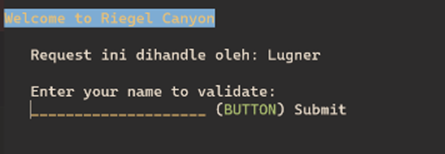

## Soal Nomor 11
Lalu buat untuk setiap request yang mengandung /its akan di proxy passing menuju halaman https://www.its.ac.id. (11) hint: (proxy_pass)

### Jawaban Nomor 11
- Masukkan script berikut pada `Eisen`

```ruby
echo 'upstream worker {
    server 192.211.3.1;
    server 192.211.3.2;
    server 192.211.3.3;
}

server {
    listen 80;
    server_name granz.channel.e10.com www.granz.channel.e10.com;

    root /var/www/html;
    index index.html index.htm index.nginx-debian.html;

    location / {
        proxy_pass http://worker;
    }

    location ~ /its {
        proxy_pass https://www.its.ac.id;
        proxy_set_header Host www.its.ac.id;
        proxy_set_header X-Real-IP $remote_addr;
        proxy_set_header X-Forwarded-For $proxy_add_x_forwarded_for;
        proxy_set_header X-Forwarded-Proto $scheme;
    }
}' > /etc/nginx/sites-available/lb_php

service nginx restart
```
- Test pada client `Richter`
```ruby
lynx www.granz.channel.e10.com/its
```
### Result
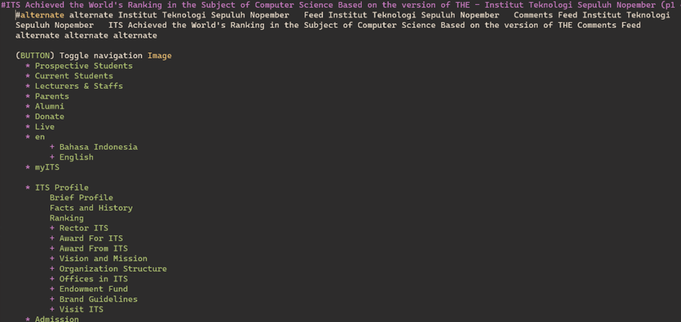

## Soal Nomor 12
Selanjutnya LB ini hanya boleh diakses oleh client dengan IP [Prefix IP].3.69, [Prefix IP].3.70, [Prefix IP].4.167, dan [Prefix IP].4.168. (12) hint: (fixed in dulu clinetnya)

### Jawaban Nomor 12
- Masukkan script berikut ke Load Balancer `Eisen`
```ruby
echo 'upstream worker {
    server 192.211.3.1;
    server 192.211.3.2;
    server 192.211.3.3;
}

server {
    listen 80;
    server_name granz.channel.e10.com www.granz.channel.e10.com;

    root /var/www/html;
    index index.html index.htm index.nginx-debian.html;

    location / {
        allow 192.211.3.69;
        allow 192.211.3.70;
        allow 192.211.4.167;
        allow 192.211.4.168;
        deny all;
        proxy_pass http://worker;
    }

    location /its {
        proxy_pass https://www.its.ac.id;
        proxy_set_header Host www.its.ac.id;
        proxy_set_header X-Real-IP $remote_addr;
        proxy_set_header X-Forwarded-For $proxy_add_x_forwarded_for;
        proxy_set_header X-Forwarded-Proto $scheme;
    }
}' > /etc/nginx/sites-available/lb_php

service nginx restart
```
- Lakukan fixed address untuk client yang akan digunakan untuk testing yaitu Richter. Hal ini dapat dilakukan dengan menambahkan script berikut ke dhcp server
```ruby
host Richter {
    hardware ethernet fe:c0:13:f5:1c:02;
    fixed-address 192.211.3.69;
}
```
- Restart node `Richter`

### Result
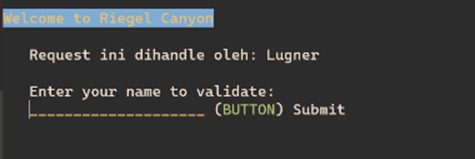

## Soal Nomor 13
Semua data yang diperlukan, diatur pada Denken dan harus dapat diakses oleh Frieren, Flamme, dan Fern. (13)

### Jawaban Nomor 13
- Masukkan script berikut ke database server yaitu `Denken`
```ruby
echo '# This group is read both by the client and the server
# use it for options that affect everything
[client-server]

# Import all .cnf files from configuration directory
!includedir /etc/mysql/conf.d/
!includedir /etc/mysql/mariadb.conf.d/

# Options affecting the MySQL server (mysqld)
[mysqld]
skip-networking=0
skip-bind-address
' > /etc/mysql/my.cnf
```
- Ganti bind-address pada file `/etc/mysql/mariadb.conf.d/50-server.cnf` menjadi `0.0.0.0`
```ruby
cd /etc/mysql/mariadb.conf.d/50-server.cnf

bind-address            = 0.0.0.0

service mysql restart
```
- Jalankan perintah berikut
```ruby
mysql -u root -p
Enter password: 

CREATE USER 'kelompoke10'@'%' IDENTIFIED BY 'passworde10';
CREATE USER 'kelompoke10'@'localhost' IDENTIFIED BY 'passworde10';
CREATE DATABASE dbkelompoke10;
GRANT ALL PRIVILEGES ON *.* TO 'kelompoke10'@'%';
GRANT ALL PRIVILEGES ON *.* TO 'kelompoke10'@'localhost';
FLUSH PRIVILEGES;
```

### Result
- Test di salah satu laravel worker 
```ruby
mariadb --host=192.211.2.1 --port=3306 --user=kelompoke10 --password=passworde10 dbkelompoke10 -e "SHOW DATABASES;"
```


## Soal Nomor 14
Frieren, Flamme, dan Fern memiliki Riegel Channel sesuai dengan quest guide berikut. Jangan lupa melakukan instalasi PHP8.0 dan Composer

### Jawaban Nomor 14
- Masukkan script berikut ke laravel worker
```ruby
# Install Composer
wget https://getcomposer.org/download/2.0.13/composer.phar
chmod +x composer.phar
mv composer.phar /usr/local/bin/composer

# Install Git 
apt-get install git -y
cd /var/www && git clone https://github.com/martuafernando/laravel-praktikum-jarkom
cd /var/www/laravel-praktikum-jarkom && composer update
cd /var/www/laravel-praktikum-jarkom && cp .env.example .env
echo 'APP_NAME=Laravel
APP_ENV=local
APP_KEY=
APP_DEBUG=true
APP_URL=http://localhost

LOG_CHANNEL=stack
LOG_DEPRECATIONS_CHANNEL=null
LOG_LEVEL=debug

DB_CONNECTION=mysql
DB_HOST=192.211.2.1
DB_PORT=3306
DB_DATABASE=dbkelompoke10
DB_USERNAME=kelompoke10
DB_PASSWORD=passworde10

BROADCAST_DRIVER=log
CACHE_DRIVER=file
FILESYSTEM_DISK=local
QUEUE_CONNECTION=sync
SESSION_DRIVER=file
SESSION_LIFETIME=120

MEMCACHED_HOST=127.0.0.1

REDIS_HOST=127.0.0.1
REDIS_PASSWORD=null
REDIS_PORT=6379

MAIL_MAILER=smtp
MAIL_HOST=mailpit
MAIL_PORT=1025
MAIL_USERNAME=null
MAIL_PASSWORD=null
MAIL_ENCRYPTION=null
MAIL_FROM_ADDRESS="hello@example.com"
MAIL_FROM_NAME="${APP_NAME}"

AWS_ACCESS_KEY_ID=
AWS_SECRET_ACCESS_KEY=
AWS_DEFAULT_REGION=us-east-1
AWS_BUCKET=
AWS_USE_PATH_STYLE_ENDPOINT=false

PUSHER_APP_ID=
PUSHER_APP_KEY=
PUSHER_APP_SECRET=
PUSHER_HOST=
PUSHER_PORT=443
PUSHER_SCHEME=https
PUSHER_APP_CLUSTER=mt1

VITE_PUSHER_APP_KEY="${PUSHER_APP_KEY}"
VITE_PUSHER_HOST="${PUSHER_HOST}"
VITE_PUSHER_PORT="${PUSHER_PORT}"
VITE_PUSHER_SCHEME="${PUSHER_SCHEME}"
VITE_PUSHER_APP_CLUSTER="${PUSHER_APP_CLUSTER}"' > /var/www/laravel-praktikum-jarkom/.env
cd /var/www/laravel-praktikum-jarkom && php artisan key:generate
cd /var/www/laravel-praktikum-jarkom && php artisan config:cache
cd /var/www/laravel-praktikum-jarkom && php artisan migrate
cd /var/www/laravel-praktikum-jarkom && php artisan db:seed
cd /var/www/laravel-praktikum-jarkom && php artisan storage:link
cd /var/www/laravel-praktikum-jarkom && php artisan jwt:secret
cd /var/www/laravel-praktikum-jarkom && php artisan config:clear
chown -R www-data.www-data /var/www/laravel-praktikum-jarkom/storage
```
- Konfigurasi `nginx` sebagai berikut pada masing-masing worker dimana port nya adalah sebagai berikut :
```ruby
192.211.4.1:8001; # Fern 
192.211.4.2:8002; # Flamme
192.211.4.3:8003; # Frieren
```
- Masukkan port diatas sesuai dengan worker pada script berikut
```ruby
echo 'server {
    listen <port>;

    root /var/www/laravel-praktikum-jarkom/public;

    index index.php index.html index.htm;
    server_name _;

    location / {
            try_files $uri $uri/ /index.php?$query_string;
    }

    # pass PHP scripts to FastCGI server
    location ~ \.php$ {
      include snippets/fastcgi-php.conf;
      fastcgi_pass unix:/var/run/php/php8.0-fpm.sock;
    }

    location ~ /\.ht {
            deny all;
    }

    error_log /var/log/nginx/implementasi_error.log;
    access_log /var/log/nginx/implementasi_access.log;
}' > /etc/nginx/sites-available/laravel-worker
```
### Result
- Test dengan command ini 
```ruby
lynx localhost:[port]
```
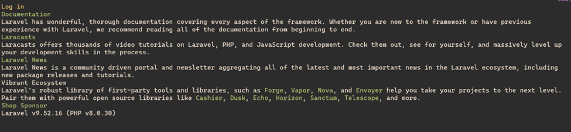

## Soal Nomor 15
Granz Channel memiliki beberapa endpoint yang harus ditesting sebanyak 100 request dengan 10 request/second. Tambahkan response dan hasil testing pada grimoire. Untuk POST /api/auth/register

### Jawaban Nomor 15
- Testing menggunakan `Apache Benchmark` pada salah satu worker. Gunakan bantuan file `.json` yang akan digunakan sebagai body yang akan dikirim pada endpoint `/api/auth/register`.
```ruby
echo '
{
  "username": "kelompokE10",
  "password": "passwordE10"
}' > register.json
```
- Masukkan command berikut pada client `Richter`
```ruby
ab -n 100 -c 10 -p register.json -T application/json http://192.211.4.1:8001/api/auth/register
```
### Result


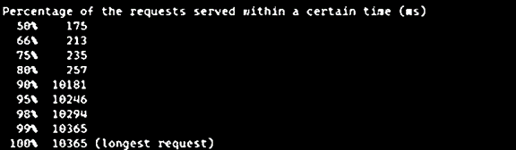

## Soal Nomor 16
Granz Channel memiliki beberapa endpoint yang harus ditesting sebanyak 100 request dengan 10 request/second. Tambahkan response dan hasil testing pada grimoire. Untuk POST /api/auth/login

### Jawaban Nomor 16
- Testing menggunakan `Apache Benchmark` pada salah satu worker. Gunakan bantuan file `.json` yang akan digunakan sebagai body yang akan dikirim pada endpoint `/api/auth/login`.
```ruby
echo '
{
  "username": "kelompokE10",
  "password": "passwordE10"
}' > login.json
```
- Masukkan command berikut pada client `Richter`
```ruby
ab -n 100 -c 10 -p login.json -T application/json http://192.211.4.1:8001/api/auth/login
```
### Result

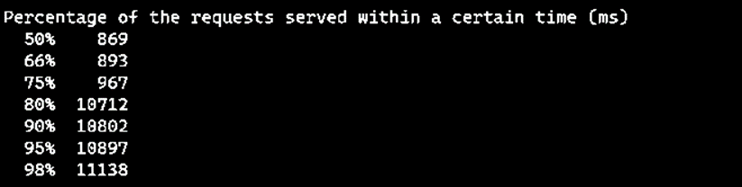

## Soal Nomor 17
Granz Channel memiliki beberapa endpoint yang harus ditesting sebanyak 100 request dengan 10 request/second. Tambahkan response dan hasil testing pada grimoire. Untuk GET /api/me

### Jawaban Nomor 17
- Testing menggunakan `Apache Benchmark` pada salah satu worker.
- Dapatkan tokennya terlebih dahulu sebelum mengakses endpoint `/api/me`
```ruby
curl -X POST -H "Content-Type: application/json" -d @login.json http://192.211.4.1:8001/api/auth/login > login_output.txt
```
- Set token secara global
```ruby
token=$(cat login_output.txt | jq -r '.token')
```
- Masukkan command berikut pada client `Richter`
```ruby
ab -n 100 -c 10 -H "Authorization: Bearer $token" http://192.211.4.1:8001/api/me
```
### Result
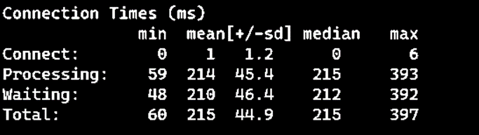
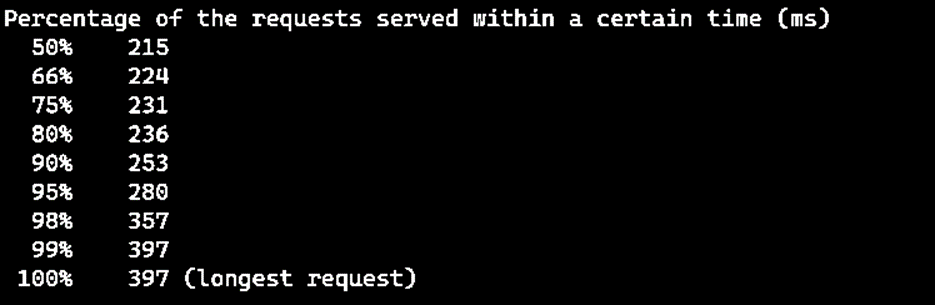

## Soal Nomor 18
Untuk memastikan ketiganya bekerja sama secara adil untuk mengatur Riegel Channel maka implementasikan Proxy Bind pada Eisen untuk mengaitkan IP dari Frieren, Flamme, dan Fern

### Jawaban Nomor 18
- Karena harus bekerja secara adil, maka algoritma yang dipakai adalah `Load Balancing`.
```ruby
echo 'upstream worker {
    server 192.211.4.1:8001;
    server 192.211.4.2:8002;
    server 192.211.4.3:8003;
}

server {
    listen 80;
    server_name riegel.canyon.e10.com www.riegel.canyon.e10.com;

    location / {
        proxy_pass http://worker;
    }
} 
' > /etc/nginx/sites-available/laravel-worker

ln -s /etc/nginx/sites-available/laravel-worker /etc/nginx/sites-enabled/laravel-worker

service nginx restart
```
### Result
- Test pada client `Richter`
```ruby
ab -n 100 -c 10 -p login.json -T application/json http://www.riegel.canyon.e10.com/api/auth/login
```

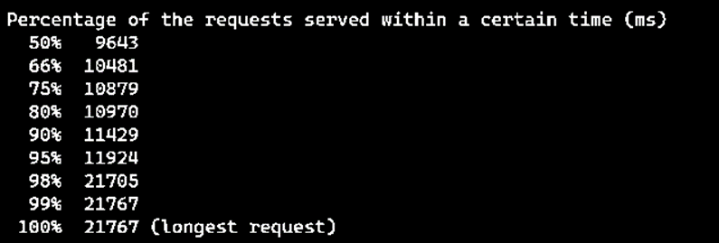

## Soal Nomor 19
Untuk meningkatkan performa dari Worker, coba implementasikan PHP-FPM pada Frieren, Flamme, dan Fern. Untuk testing kinerja naikkan 
- pm.max_children
- pm.start_servers
- pm.min_spare_servers
- pm.max_spare_servers
sebanyak tiga percobaan dan lakukan testing sebanyak 100 request dengan 10 request/second kemudian berikan hasil analisisnya pada Grimoire

### Jawaban Nomor 19
Untuk mengerjakan soal ini terdapat beberapa penjelasan sebagai berikut

- `pm.max_children` Menentukan jumlah maksimum pekerja PHP (proses anak) yang dapat berjalan secara bersamaan. Nilai ini sebaiknya disesuaikan dengan kapasitas sumber daya server. Jika terlalu rendah, server mungkin tidak dapat menangani banyak permintaan secara bersamaan, sementara jika terlalu tinggi, dapat menyebabkan kelebihan beban dan kekurangan sumber daya.

- `pm.start_servers` Menentukan jumlah pekerja PHP yang akan dimulai secara otomatis ketika PHP-FPM pertama kali dijalankan atau direstart. Ini membantu dalam mengoptimalkan performa pada saat server pertama kali dimulai.

- `pm.min_spare_servers` Menentukan jumlah minimum pekerja PHP yang tetap berjalan saat server berjalan. Ini membantu menjaga agar server tetap responsif terhadap permintaan bahkan saat lalu lintas rendah.

- `pm.max_spare_servers` Menentukan jumlah maksimum pekerja PHP yang dapat berjalan tetapi tidak menangani permintaan. Jumlah ini disesuaikan dengan kebutuhan untuk menangani lonjakan lalu lintas tanpa menambahkan terlalu banyak sumber daya ketika beban rendah.

Akan ada 4 konfigurasi terhadap proses package manager pada masing-masing worker yang nantinya akan dilakukan untuk testing.

- **Script 1**
```ruby
echo '[www]
user = www-data
group = www-data
listen = /run/php/php8.0-fpm.sock
listen.owner = www-data
listen.group = www-data
php_admin_value[disable_functions] = exec,passthru,shell_exec,system
php_admin_flag[allow_url_fopen] = off

; Choose how the process manager will control the number of child processes.

pm = dynamic
pm.max_children = 5
pm.start_servers = 2
pm.min_spare_servers = 1
pm.max_spare_servers = 3' > /etc/php/8.0/fpm/pool.d/www.conf

service php8.0-fpm restart
```
- **Script 2**
```ruby
echo '[www]
user = www-data
group = www-data
listen = /run/php/php8.0-fpm.sock
listen.owner = www-data
listen.group = www-data
php_admin_value[disable_functions] = exec,passthru,shell_exec,system
php_admin_flag[allow_url_fopen] = off

; Choose how the process manager will control the number of child processes.

pm = dynamic
pm.max_children = 25
pm.start_servers = 5
pm.min_spare_servers = 3
pm.max_spare_servers = 10' > /etc/php/8.0/fpm/pool.d/www.conf

service php8.0-fpm restart
```
- **Script 3**
```ruby
echo '[www]
user = www-data
group = www-data
listen = /run/php/php8.0-fpm.sock
listen.owner = www-data
listen.group = www-data
php_admin_value[disable_functions] = exec,passthru,shell_exec,system
php_admin_flag[allow_url_fopen] = off

; Choose how the process manager will control the number of child processes.

pm = dynamic
pm.max_children = 50
pm.start_servers = 8
pm.min_spare_servers = 5
pm.max_spare_servers = 15' > /etc/php/8.0/fpm/pool.d/www.conf

service php8.0-fpm restart
```
- **Script 4**
```ruby
echo '[www]
user = www-data
group = www-data
listen = /run/php/php8.0-fpm.sock
listen.owner = www-data
listen.group = www-data
php_admin_value[disable_functions] = exec,passthru,shell_exec,system
php_admin_flag[allow_url_fopen] = off

; Choose how the process manager will control the number of child processes.

pm = dynamic
pm.max_children = 75
pm.start_servers = 10
pm.min_spare_servers = 5
pm.max_spare_servers = 20' > /etc/php/8.0/fpm/pool.d/www.conf

service php8.0-fpm restart
```

### Result
- Script 1
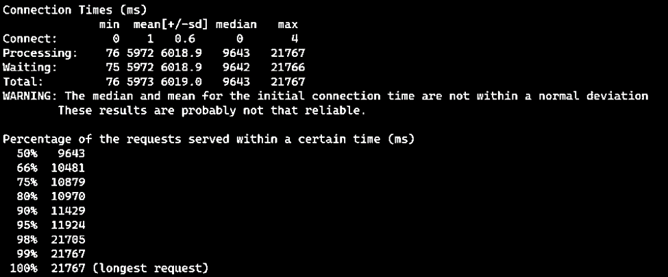
- Script 2
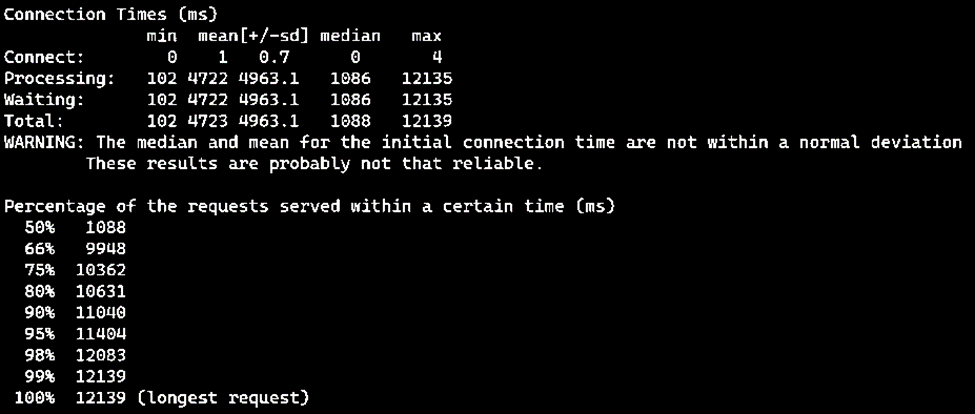
- Script 3
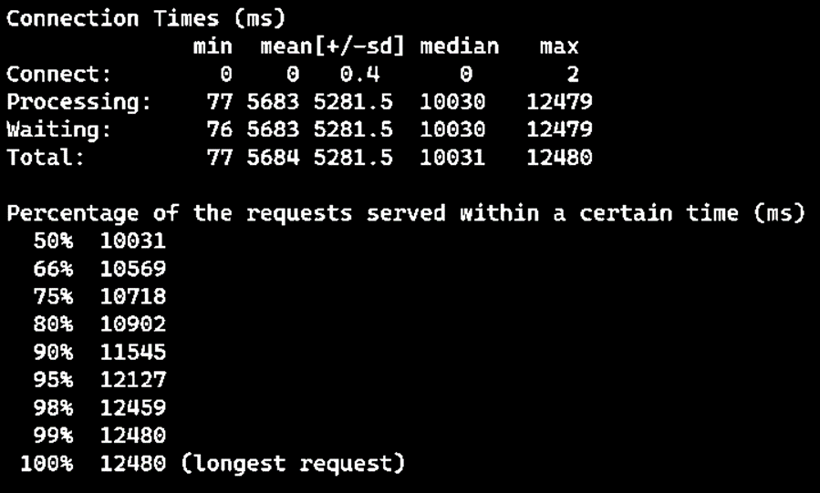
- Script 4
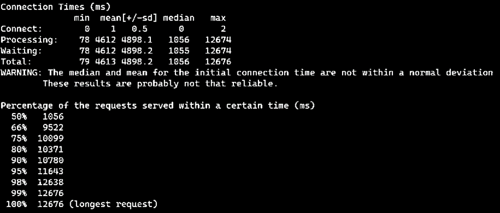

## Soal Nomor 20
Nampaknya hanya menggunakan PHP-FPM tidak cukup untuk meningkatkan performa dari worker maka implementasikan Least-Conn pada Eisen. Untuk testing kinerja dari worker tersebut dilakukan sebanyak 100 request dengan 10 request/second

### Jawaban Nomor 20
Karena proses yang telah di konfigurasi sebelumnya pada masing-masing worker tepatnya pada `package manager` dan ternyata hasil yang diberikan juga tidak cukup untuk meningkatkan performa worker. Oleh karena itu, ditambahkan algoritma pada load balancer tersebut dengan menggunakan `Least-connection` dimana algoritma ini akan melakukan prioritas pembagian dari beban kinerja yang paling rendah. Node master akan mencatat semua beban dan kinerja dari semua node, dan akan melakukan prioritas dari beban yang paling rendah. Sehingga diharapkan tidak ada server dengan beban yang rendah.
```ruby
echo 'upstream worker {
    least_conn;
    server 192.211.4.1:8001;
    server 192.211.4.2:8002;
    server 192.211.4.3:8003;
}

server {
    listen 80;
    server_name riegel.canyon.e10.com www.riegel.canyon.e10.com;

    location / {
        proxy_pass http://worker;
    }
} 
' > /etc/nginx/sites-available/laravel-worker

service nginx restart
```

### Result
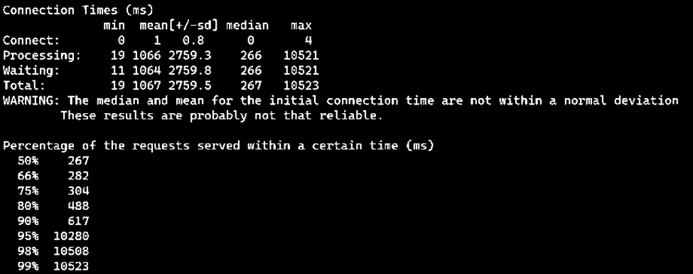
